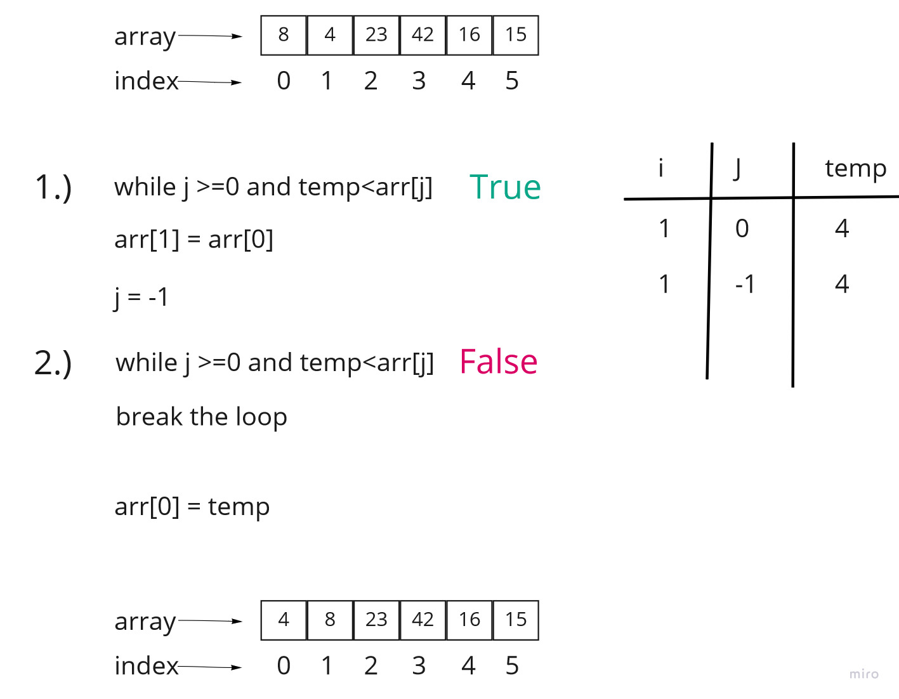
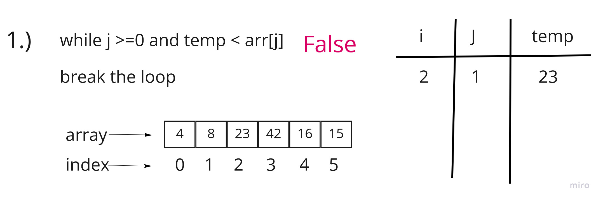
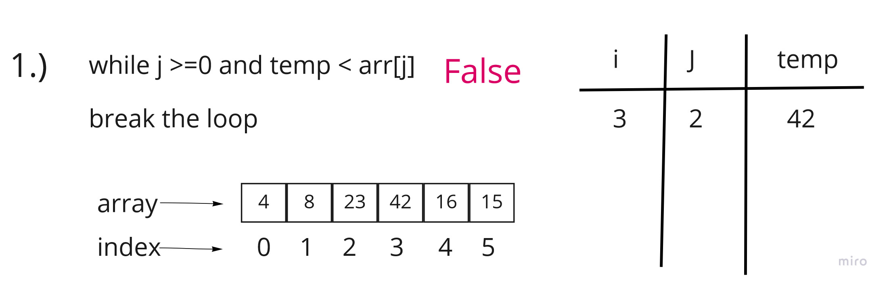
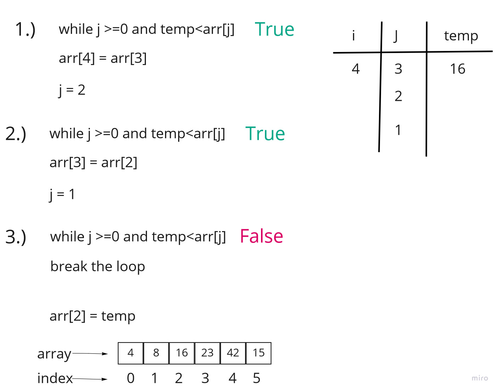
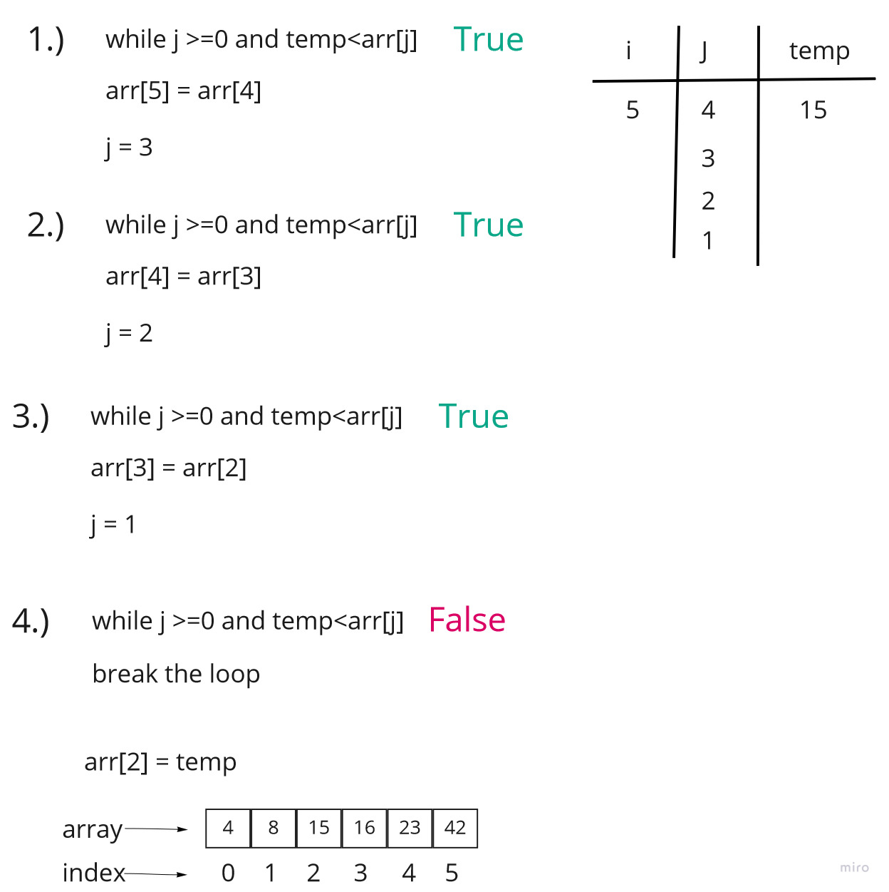

# Insertion Sort
its a sorting algorithm that builds a sorted array or list one by one.

### pseudo code:

```
InsertionSort(int[] arr)

    FOR i = 1 to arr.length

      int j <-- i - 1
      int temp <-- arr[i]

      WHILE j >= 0 AND temp < arr[j]
        arr[j + 1] <-- arr[j]
        j <-- j - 1

      arr[j + 1] <-- temp
```

### Efficency
#### Time: O(n^2)
#### Space: O(1)


### tracing the code:
sample array = [8,4,23,42,16,15];

###  i=1:



###  i=2:



###  i=3:



###  i=4:



###  i=5:
