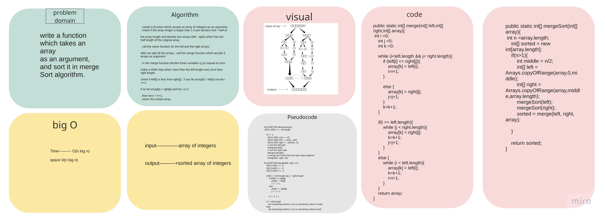
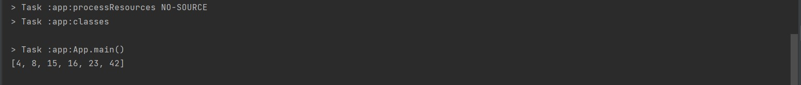

# Challenge Summary
write a finction which sorts an array by dividing it to halfs each time until it's sorted then merge it.

## Whiteboard Process


## Approach & Efficiency
the big O notation is: O(n log n) for both time and space complexity becuase i use a method like a tree .

## Solution

example:

```
  int[] arrayForTest = {8,4,23,42,16,15};


        System.out.println(Arrays.toString(mergeSort(arrayForTest)));
```

output:

