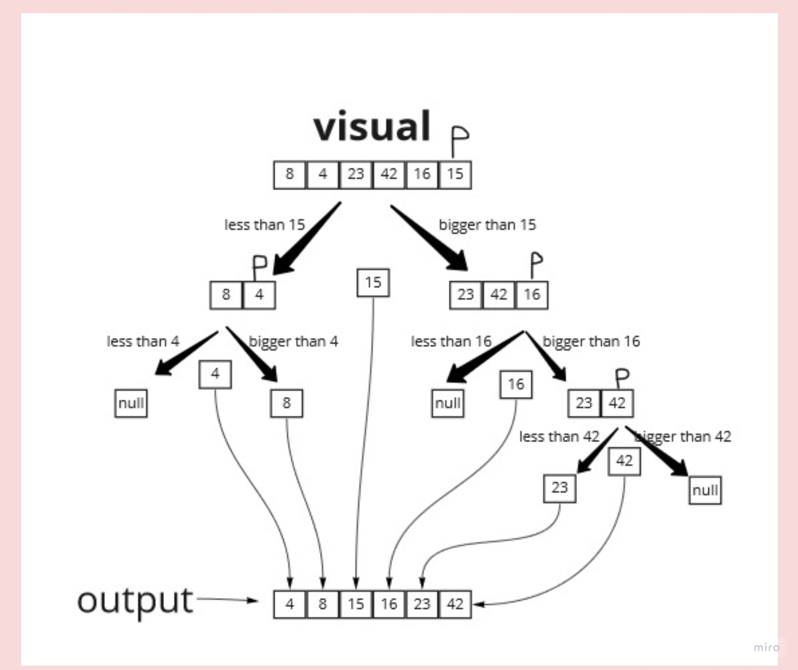

# Quick Sort

A sorting technique that sequences a list by continuously dividing the list into two parts and moving the lower items to one side and the higher items to the other. It starts by picking one item in the entire list to serve as a pivot point. The pivot could be the first item or a randomly chosen one.

### big O notation

Time complexity: O(n^2)

Space complexity: O(1)

### Tracing

sample array = [8,4,23,42,16,15]

#### Pass1:

the first thing we devide the array into two halves , one half is less than the Pivot and the other one is larger.

#### Pass2:

the two halves will be devided again in the same way as we did in pass1 so we will have 4 arrays now.

#### pass3:

+ the same thing in the pass1 one will keep happening untill the whole elements of the array are sorted from the smallest to largest.
+ whenever you see a P in the picture that means this is the pivot which we will devide the array accordingly.

