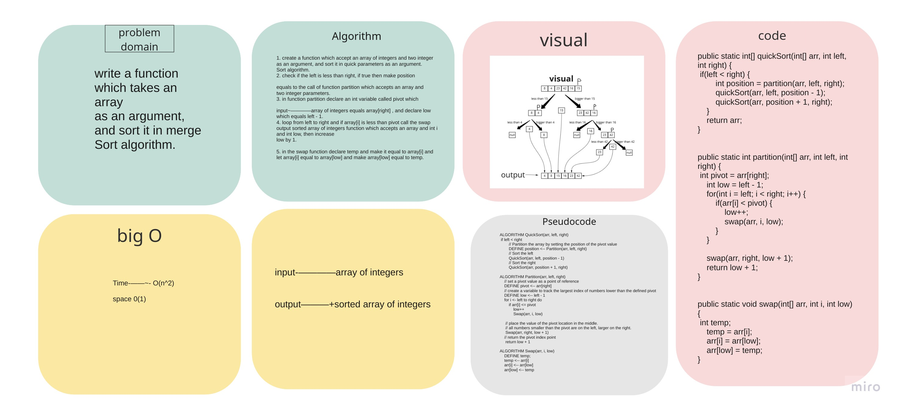
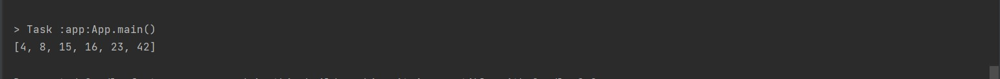

# Challenge Summary

write a function which takes an array as an argument, and sort it in quick sort algorithm.

## Whiteboard Process



## Approach & Efficiency

Time complexity: O(n^2)

Space complexity: O(1)

## Solution
example:

```
        int[] arrayForTest = {8,4,23,42,16,15};

        System.out.println(Arrays.toString(quickSort(arrayForTest, 0, arrayForTest.length-1)));
    }
```

output:

