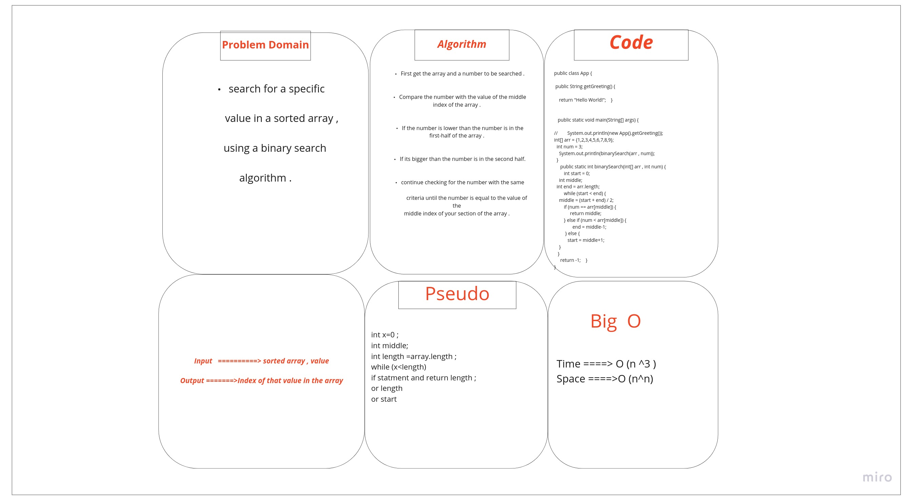

# Binary Search of Sorted Array
search for a specific value in a sorted array ,

using a binary search algorithm .

## Whiteboard Process

## Approach & Efficiency
Thats takes from me 1 hours but i still confuse in some topic .