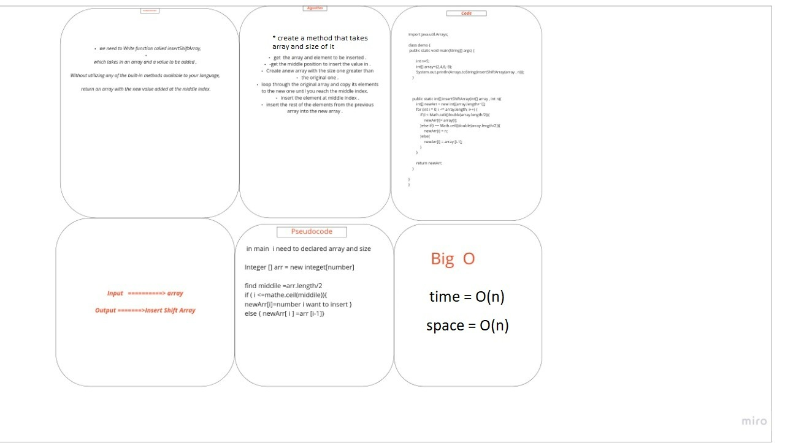

# Insert to Middle of an Array

we need to Write function called insertShiftArray,

which takes in an array and a value to be added ,

Without utilizing any of the built-in methods available to your language,

 return an array with the new value added at the middle index.

## Whiteboard Process :

## Approach & Efficiency :
Thats takes from me 1 hours but i still confuse in some topic .

