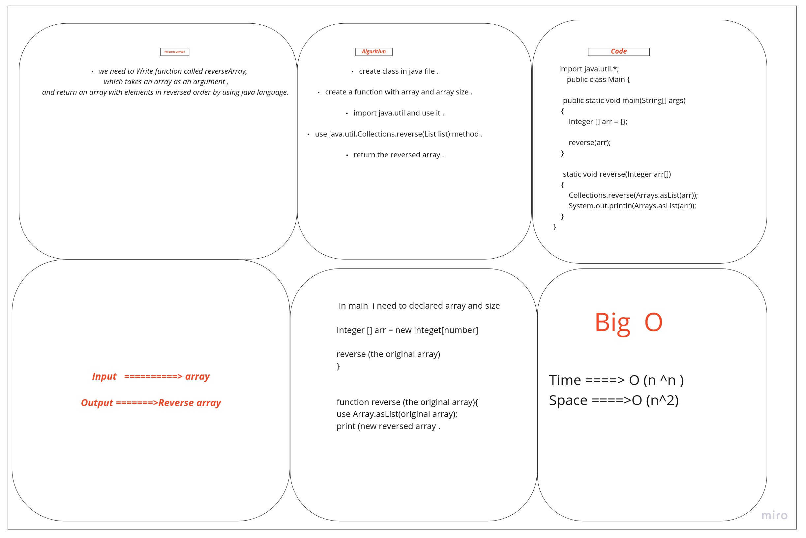

# Reverse an Array :

we need to Write function called reverseArray which takes an array as an argument ,and eturn an array with elements in reversed order by using java language.

## Whiteboard Process :

## Approach & Efficiency :
Thats takes from me 2 hours because i still learning the way of write code and how i find and use the tooles like  :

### Using Collections.reverse() method .
