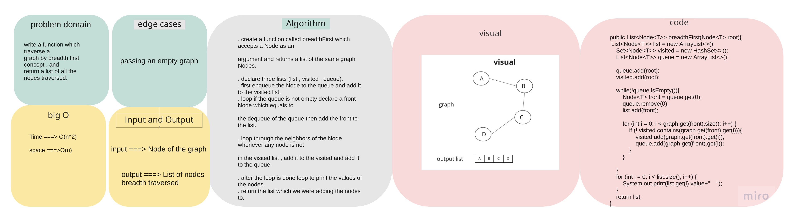
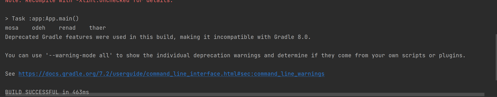

# Challenge Summary

write a function which traverse a
graph by breadth first concept , and
return a list of all the nodes traversed.

## Whiteboard Process



## Approach & Efficiency

space = O(n)   because we declared a list

time = O(n^2)   because we use a nested loop

## Solution

The code :

```
  Graph<String> breadthFirstTest = new Graph<>();
        Node mosa = breadthFirstTest.addNode("mosa");
        Node odeh =  breadthFirstTest.addNode("odeh");
        Node renad = breadthFirstTest.addNode("renad");
        Node thaer = breadthFirstTest.addNode("thaer");

        breadthFirstTest.addEdge(mosa,odeh,true);
        breadthFirstTest.addEdge(odeh,renad,true);
        breadthFirstTest.addEdge(renad,thaer,true);
        breadthFirstTest.addEdge(odeh,thaer,true);

        breadthFirstTest.breadthFirst(mosa);
```

this is its output:

