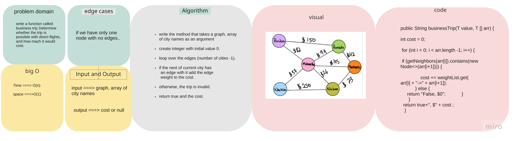

## business trip

### Challenge

Write a function called business trip
Determine whether the trip is possible with direct flights, and how much it would cost.

- input -> graph, array of city names.

- output -> cost or null.

### Whiteboard Process

### Approach & Efficiency

- time : O(n) - 1 for loop.

- scape : O(1) - no extra spaces.
