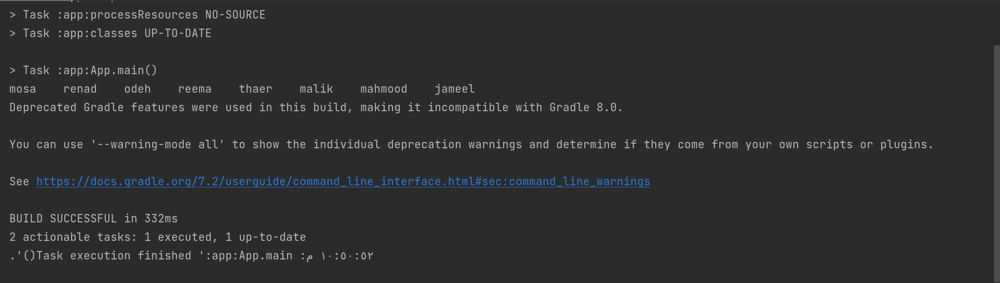

# Challenge Summary

write a function which traverse a graph by depth first concept , and return a list of all the nodes traversed..

## Whiteboard Process


## Approach & Efficiency

the big O notation is:
O(n) for time because we use a loop .
O(1) for space because we didnt create a new list we only pass to an already created list.

## Solution

this is a sample of the code:

```
  Graph<String> graphDepthFirst = new Graph<>();

        Node mosa = graphDepthFirst.addNode("mosa");
        Node renad =  graphDepthFirst.addNode("renad");
        Node odeh = graphDepthFirst.addNode("odeh");
        Node thaer = graphDepthFirst.addNode("thaer");
        Node malik = graphDepthFirst.addNode("malik");
        Node jameel = graphDepthFirst.addNode("jameel");
        Node reema = graphDepthFirst.addNode("reema");
        Node mahmood = graphDepthFirst.addNode("mahmood");


        graphDepthFirst.addEdge(mosa,renad,true);
        graphDepthFirst.addEdge(mosa,thaer,true);
        graphDepthFirst.addEdge(renad,odeh,true);
        graphDepthFirst.addEdge(renad,thaer,true);
        graphDepthFirst.addEdge(odeh,reema,true);
        graphDepthFirst.addEdge(thaer,malik,true);
        graphDepthFirst.addEdge(thaer,mahmood,true);
        graphDepthFirst.addEdge(thaer,jameel,true);
        graphDepthFirst.addEdge(mahmood,jameel,true);


        graphDepthFirst.depthFirst(mosa);

```

 The output is:


