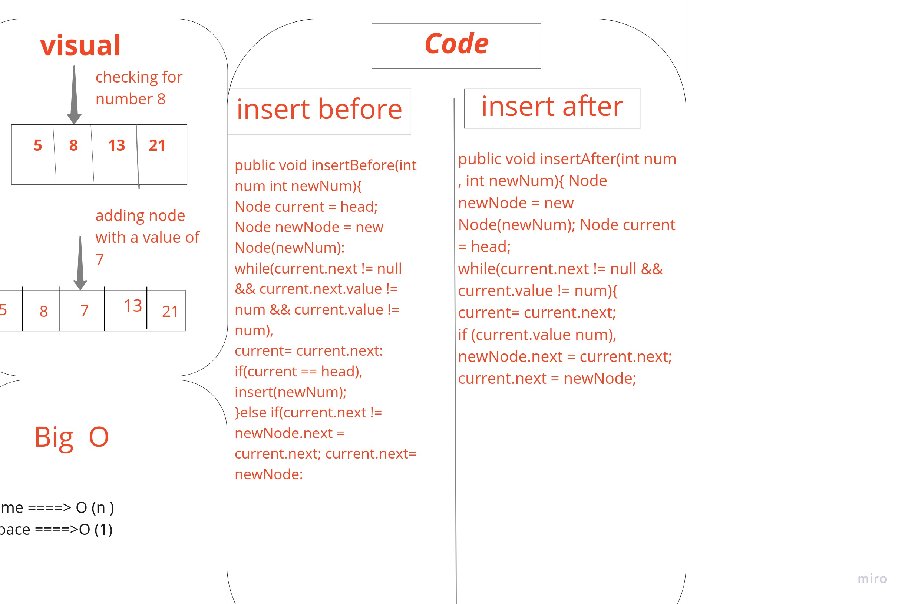
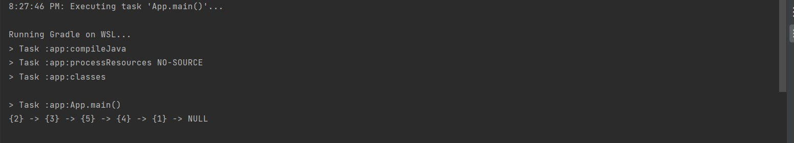

# Challenge Summary

adding nodes to a linked list in three ways:

1. append: adding node to the end of the linked list.

2. insertBefore: adding node before a certain node in the list.

3. insertAfter: adding node after a certain node in the list.

## Approach & Efficiency

time = big O(n)
space= big O(1)

## whiteboard



## Solution
example of the code : 

```
LinkedList testList = new LinkedList();
        testList.insert(5);
        testList.insert(3);
        testList.insert(2);
        testList.append(1);
        testList.insertBefore(1,4);
        testList.insertAfter(13,14);


        System.out.println(testList.toString());
```

output:




