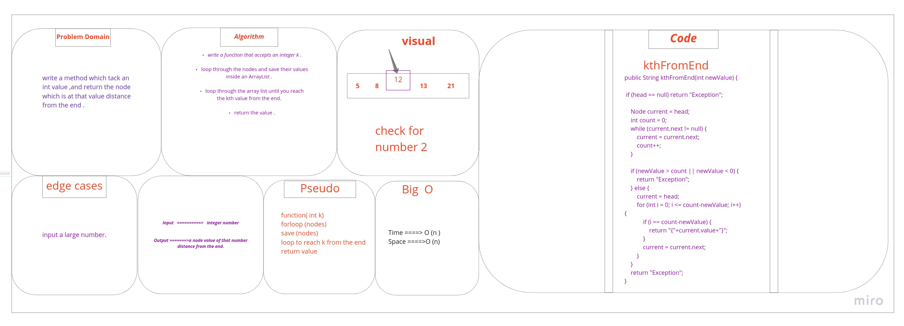
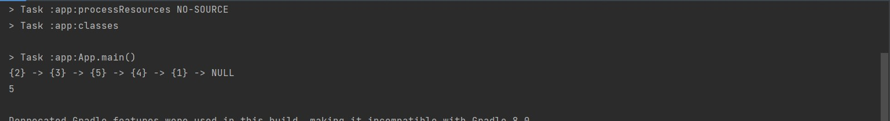

# Challenge Summary

* adding a method called kthFromEnd which accept an int parameter k , and return the node which is at k distance from the end of the linked list.

## Approach & Efficiency

time = big O(n)
space= big O(n)

## whiteboard

## Solution
example of the code : 

System.out.println(testList.kthFromEnd(4));

output:

