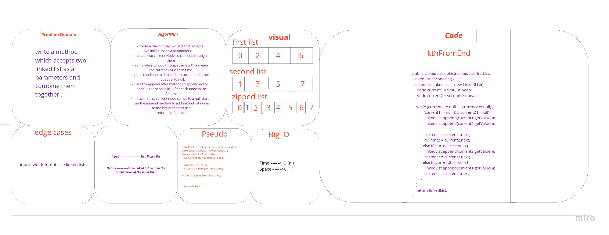
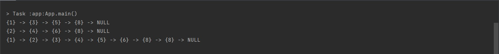

# Challenge Summary

* writing a function that accept two linked lists as a parameters, and retern a linked list which have both of them combined.

## Approach & Efficiency

time = big O(n)
space= big O(1)

## whiteboard

## Solution
example of the code : 

 LinkedList list1 = new LinkedList();
        list1.append(8);
        list1.append(5);
        list1.append(3);
        list1.append(1);

        LinkedList list2 = new LinkedList();
        list2.append(8);
        list2.append(6);
        list2.append(4);
        list2.append(2);

        System.out.println(list1);
        System.out.println(list2);

        System.out.println(zipTwoLinkedLists(list1,list2));

output:

