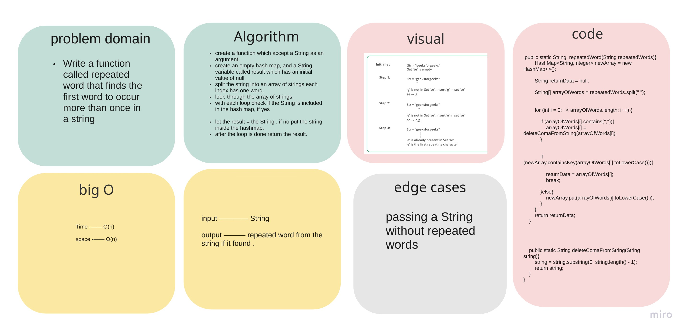
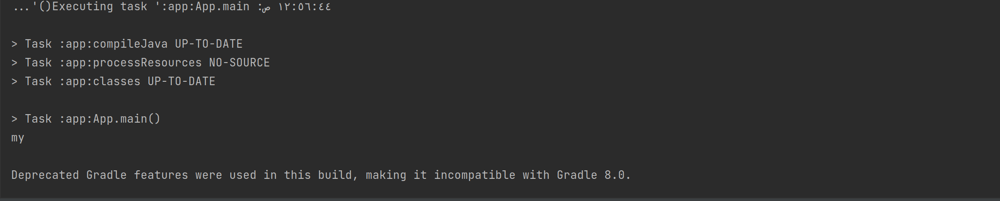

# Challenge Summary

Write a function called repeated word that finds the first word to occur more than once in a string

## Whiteboard Process



## Approach & Efficiency

Time : O(n)
Space : O(n)

 because i used a loop .

## Solution

Example code :

```
     String repeated = "I need to change my life ,but my life did not need that";
        System.out.println(repeatedWord(repeated));
```
The output :


