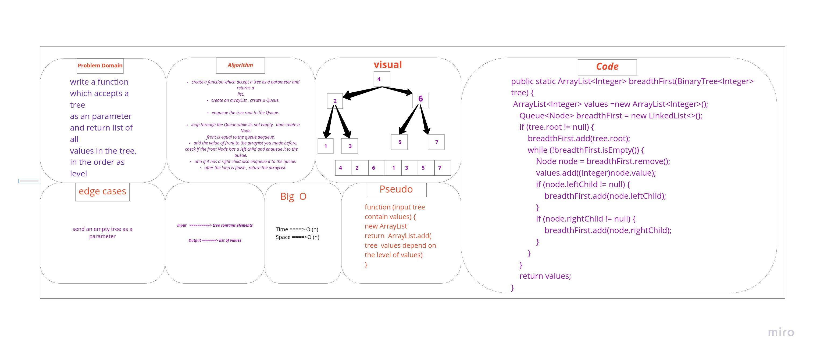
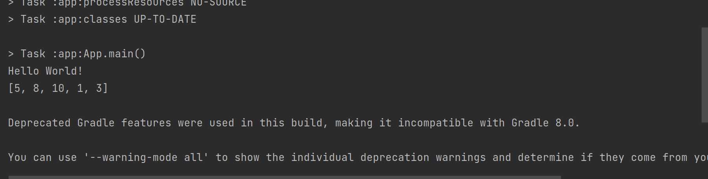

# Challenge Summary
write a function which accepts a tree as an parameter and return list of all values in the tree .

## Whiteboard Process


## Approach & Efficiency

* time =O(n)
* space =O(n)

because i used while to loop and i created a list.

## Solution

 an example  :

```
    BinarySearchTree<Integer> breadthTest = new BinarySearchTree<>(5);
        breadthTest.root.leftChild=new Node<>(8);
        breadthTest.root.rightChild=new Node<>(10);
        breadthTest.root.leftChild.leftChild=new Node<>(1);
        breadthTest.root.leftChild.rightChild=new Node<>(3);

        System.out.println(breadthFirst(breadthTest));

```

The output :

